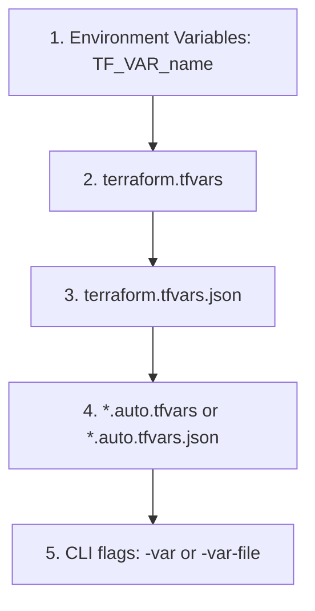

# Terraform Variables with Azure: Ultimate Interview Guide

This guide is optimized to help you ace questions about **Terraform Variables, Locals, and Outputs** during your Azure DevOps / Cloud Engineering interviews. It covers the core concepts, advanced features (like validation and sensitivity), precedence rules, and Azure-specific use cases.

---

## 1. The Three Musketeers of Terraform Values
In Terraform, variables and values are split into three distinct types:

| Type | Block | Purpose | Scope / Analogy |
| :--- | :--- | :--- | :--- |
| **Input Variables** | `variable "name" {}` | Parameters passed into the configuration. | Function Arguments / Parameters |
| **Local Values** | `locals { name = value }` | Internal temporary variables or expressions. | Local Variables inside a function |
| **Output Values** | `output "name" {}` | Values exposed to the console or other states. | Function Return Values |

---

## 2. Input Variables (`variable` Block)
Input variables make your configurations dynamic and reusable.

### Syntax and Key Arguments:
```hcl
variable "resource_group_name" {
  type        = string
  description = "The name of the Azure Resource Group"
  default     = "rg-default-eastus"
  sensitive   = false
  nullable    = false
}
```

### Core Features (Interview Highlights):
1. **Type Constraints**: Enforces the data type of the input.
   * **Primitive Types**: `string`, `number`, `bool`.
   * **Complex/Collection Types**: `list(<TYPE>)`, `set(<TYPE>)`, `map(<TYPE>)`, `object({ <ATTR> = <TYPE> })`, `tuple([<TYPE>])`.
2. **Default Value**: If a default is provided, the variable becomes optional. If omitted, the user *must* provide a value.
3. **Sensitive**: Setting `sensitive = true` prevents Terraform from printing its value in `terraform plan` or `apply` outputs.
   > [!IMPORTANT]
   > `sensitive = true` does **not** encrypt the value in the `terraform.tfstate` file. The state file still contains the plaintext value. To secure it, you must restrict access to the backend storage account (e.g., via Azure RBAC/Entra ID).
4. **Custom Validation Rules**: You can restrict variables to only accept valid values (e.g., Azure location restrictions or naming conventions).

---

## 3. Custom Variable Validation (Interview Gold)
Interviewers love asking how you enforce standards in Terraform. You can use the `validation` block.

### Example: Azure Storage Account Naming Rules
Azure Storage Account names must be **3 to 24 characters**, containing **only lowercase letters and numbers**.

```hcl
variable "storage_account_name" {
  type        = string
  description = "The name of the Azure Storage Account."

  validation {
    # Check length (3-24) and regex (lowercase alphanumeric)
    condition     = can(regex("^[a-z0-9]{3,24}$", var.storage_account_name))
    error_message = "The storage account name must be between 3 and 24 characters long and contain only lowercase letters and numbers."
  }
}
```

### Example: Azure Location Restriction
If your organization only allows deployments in `eastus` or `westus2`:

```hcl
variable "location" {
  type        = string
  description = "The Azure region to deploy resources."

  validation {
    condition     = contains(["eastus", "westus2"], var.location)
    error_message = "Only East US (eastus) and West US 2 (westus2) regions are allowed by company policy."
  }
}
```

---

## 4. Variable Precedence (Crucial Interview Question)
**Q: "If I define a variable in multiple places, which one does Terraform use?"**

Terraform loads variables in a strict order of precedence (from **lowest priority** to **highest priority**). If a value is defined in multiple places, the highest priority wins:



1. **Environment Variables** (Lowest): Prefixed with `TF_VAR_` (e.g., `TF_VAR_location="eastus"`).
2. **`terraform.tfvars`** file: Standard variable definitions file.
3. **`terraform.tfvars.json`** file.
4. **`*.auto.tfvars` or `*.auto.tfvars.json`** files: Evaluated alphabetically.
5. **CLI flags** (Highest): `-var` or `-var-file` passed directly in command (e.g., `terraform apply -var="location=westus"`).

---

## 5. Local Values (`locals` Block)
Locals are like private variables inside your module. Use them to avoid repeating complex expressions or values.

### Why use Locals instead of Variables?
* **Variables** are inputs provided by the user/caller. They cannot contain functions, references to other resources, or complex logic.
* **Locals** can compute values dynamically based on other resources, variables, or functions.

### Example: Standardized Azure Resource Naming
```hcl
variable "environment" {
  type    = string
  default = "dev"
}

variable "project" {
  type    = string
  default = "portal"
}

locals {
  # Dynamically build resource names based on environment and project
  rg_name      = "rg-${var.project}-${var.environment}"
  storage_name = "st${var.project}${var.environment}001" // must be lowercase, alphanumeric
  
  common_tags = {
    Environment = var.environment
    Project     = var.project
    ManagedBy   = "Terraform"
  }
}

# Usage:
resource "azurerm_resource_group" "rg" {
  name     = local.rg_name
  location = "eastus"
  tags     = local.common_tags
}
```

---

## 6. Output Values (`output` Block)
Outputs are like return values. They make information about your infrastructure available on the CLI, and allow sharing of data between different Terraform configurations (using `terraform_remote_state`).

### Example: Outputting the Storage Connection String (Sensitive)
```hcl
output "resource_group_id" {
  value       = azurerm_resource_group.rg.id
  description = "The ID of the created Resource Group."
}

output "storage_primary_connection_string" {
  value       = azurerm_storage_account.sa.primary_connection_string
  description = "The primary connection string of the storage account."
  sensitive   = true # Hides it from CLI printout to prevent credential leaks
}
```

---

## 7. Top Azure-Specific Variables Interview Q&A

### Q1: How do you handle secrets (like database passwords or Service Principal secrets) in Terraform variables?
*   **Answer**:
    1. Declare the variable with `sensitive = true`. This prevents it from being logged in the console.
    2. Pass the secret dynamically at runtime in CI/CD using environment variables prefixed with `TF_VAR_` (e.g. `TF_VAR_db_password`) fetched from **Azure Key Vault**.
    3. *Crucial Security Note*: Even with `sensitive = true`, the secret is still stored in plaintext inside the `.tfstate` file. Hence, the state file must be stored in a secured remote backend (like Azure Storage with restricted Blob RBAC and encrypted at rest).

### Q2: What is the difference between a variable and a local in Terraform?
*   **Answer**:
    *   **Variables** are inputs defined by the consumer of the configuration. They cannot refer to other resources or dynamic calculations.
    *   **Locals** are calculated internally within the module. They can use functions, references, calculations, and combine other variables to create dynamic expressions. Use them to keep your code DRY (Don't Repeat Yourself).

### Q3: How can we deploy to dev, staging, and production environments using variables?
*   **Answer**:
    1. Define variables for customizable parameters (e.g., `environment`, `instance_size`, `tags`).
    2. Create environment-specific variables files: `dev.tfvars`, `staging.tfvars`, `prod.tfvars`.
    3. Run Terraform by passing the appropriate file:
       ```bash
       terraform apply -var-file="environments/prod.tfvars"
       ```

### Q4: What is the purpose of custom variable validation? Give an Azure example.
*   **Answer**: Custom validation restricts input values to conform to specific business logic or API rules before hitting Azure. For example, Azure Storage accounts must have names between 3 and 24 characters, using only lowercase letters and numbers. We can use a regex constraint inside the variable `validation` block: `condition = can(regex("^[a-z0-9]{3,24}$", var.storage_account_name))` to fail-fast locally before contacting the Azure API.
